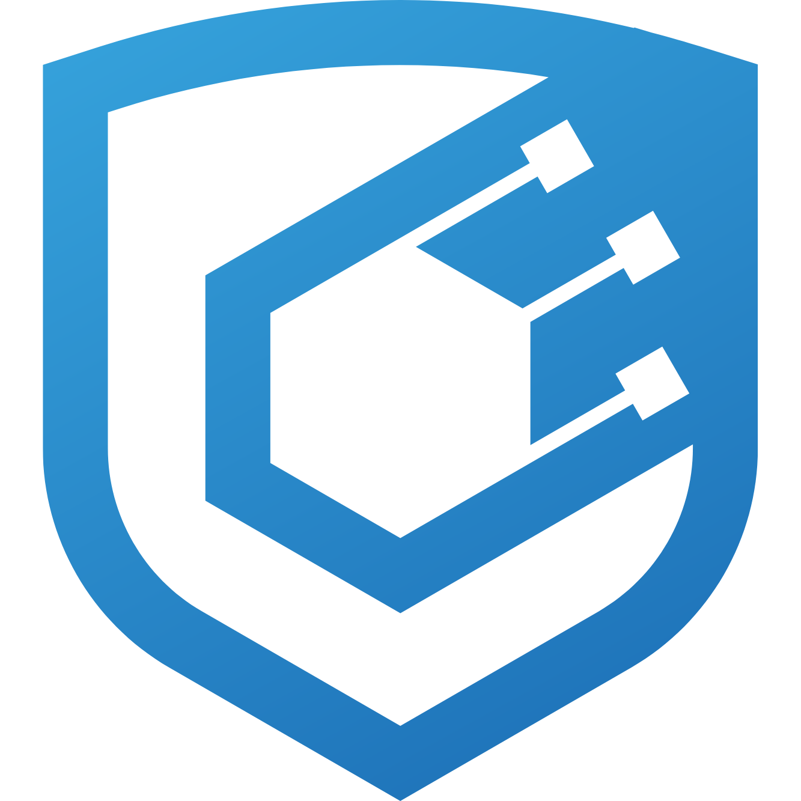

# Name

<p align="center">

<br/>

- [Name](#name)
- [About](#about)
- [Getting Started](#getting-started)
  - [Requirements](#requirements)
  - [Installation](#installation)
  - [Quickstart](#quickstart)
- [Usage](#usage)
  - [Coverage](#coverage)
- [AI-Assisted Development](#ai-assisted-development)
  - [Skills](#skills)
  - [Commands](#commands)
- [Audit Scope Details](#audit-scope-details)
  - [Roles](#roles)
  - [Known Issues](#known-issues)

# About

<!-- Include a blurb about your project, including a link to docs if applicable -->

# Getting Started

## Requirements

- [git](https://git-scm.com/book/en/v2/Getting-Started-Installing-Git)
  - You'll know you did it right if you can run `git --version` and you see a response like `git version x.x.x`
- [foundry](https://getfoundry.sh/)
  - You'll know you did it right if you can run `forge --version` and you see a response like `forge 0.2.0 (816e00b 2023-03-16T00:05:26.396218Z)`
- [just](https://github.com/casey/just)
  - You'll know you did it right if you can run `just --version` and you see a response like `just 1.x.x`
<!-- Additional requirements here -->

## Installation

```bash
git clone <MY_REPO>
cd <MY_REPO>
just
```

## Quickstart

```bash
just test
```

# Usage

## Coverage

```bash
forge coverage
```

# AI-Assisted Development

This project includes tooling for AI-assisted smart contract development via [Claude Code](https://claude.com/claude-code).

## Skills

- **[solskill](https://github.com/Cyfrin/solskill)** — production-grade Solidity development guidance (testing, security, code quality)

Install with:

```bash
npx skills add cyfrin/solskill
```

## Commands

Slash commands from [Trail of Bits' claude-code-config](https://github.com/trailofbits/claude-code-config):

| Command | Description |
|---------|-------------|
| `/fix-issue <number>` | Plan, implement, test, review, and PR for a GitHub issue |
| `/review-pr <number>` | Multi-agent PR review, fix findings, and push |
| `/merge-dependabot <org/repo>` | Evaluate and merge Dependabot PRs with dependency analysis |

# Audit Scope Details

- Commit Hash: XXX
- Files in scope:

> You'll need to install tree for [linux](https://linux.die.net/man/1/tree) or [mac](https://formulae.brew.sh/formula/tree) to run this command

```
just scope
```
- Solc Version: X.X.X
- Chain(s) to deploy to:
  - XXX
- ERC20 Token Compatibilities:
  - XXX

## Roles

- Role1: <!-- Description -->

## Known Issues

- Issue1: <!-- Description -->